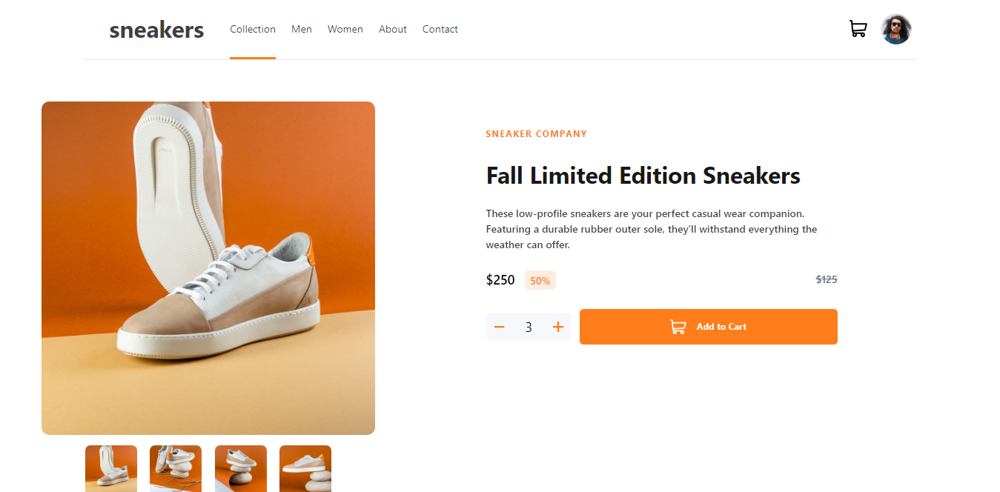
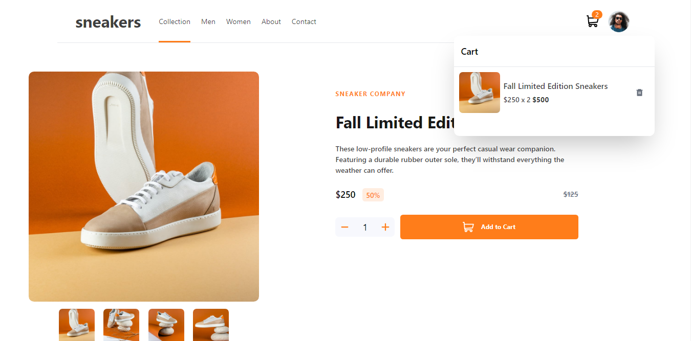
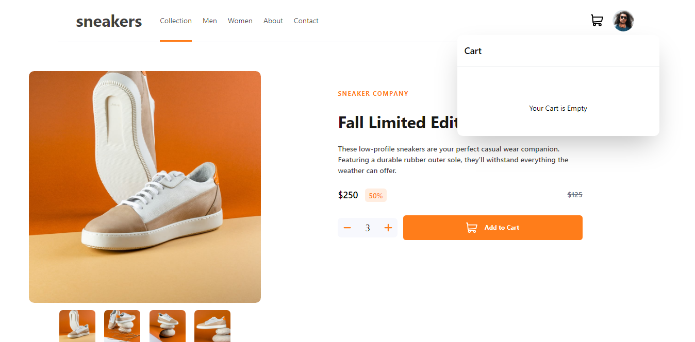
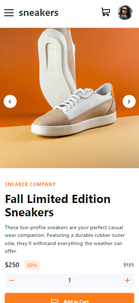
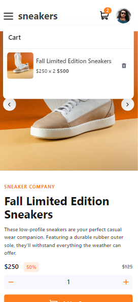
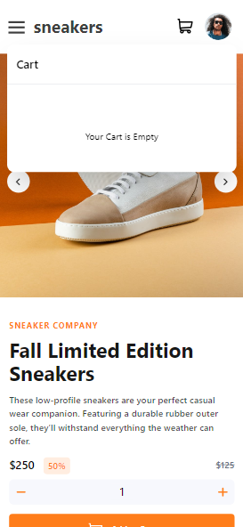
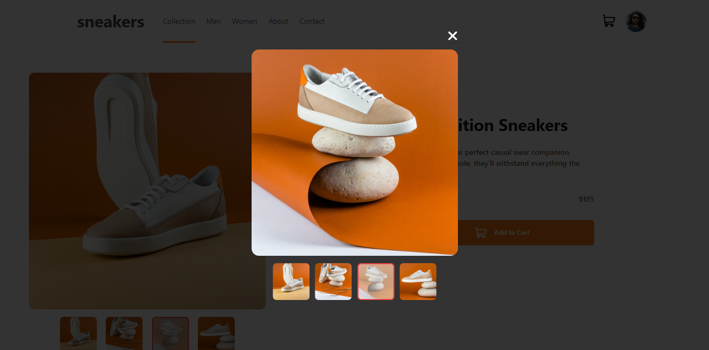

# Frontend Mentor - E-commerce product page solution

This is a solution to the [E-commerce product page challenge on Frontend Mentor](https://www.frontendmentor.io/challenges/ecommerce-product-page-UPsZ9MJp6). Frontend Mentor challenges help you improve your coding skills by building realistic projects.

## Table of contents

- [Overview](#overview)
  - [The challenge](#the-challenge)
  - [Screenshot](#screenshot)
  - [Links](#links)
- [My process](#my-process)
  - [Built with](#built-with)
  - [What I learned](#what-i-learned)
  - [Continued development](#continued-development)
- [Author](#author)

**Note: Delete this note and update the table of contents based on what sections you keep.**

## Overview

### The challenge

Users should be able to:

- View the optimal layout for the site depending on their device's screen size
- See hover states for all interactive elements on the page
- Open a lightbox gallery by clicking on the large product image
- Switch the large product image by clicking on the small thumbnail images
- Add items to the cart
- View the cart and remove items from it

### Screenshot

### Links

- Live Site URL: [Ecommerce Product Page](https://abimbola7.github.io/ecommerce-product-page/)

## My process

### Built with

- Semantic HTML5 markup
- CSS custom properties
- Flexbox
- CSS Grid
-Tailwind-CSS
- Mobile-first workflow
- [React](https://reactjs.org/) - JS library

### What I learned

i learnt how to use tailwind css and how to use react to build a website. I also learnt how to implement a lightbox gallery.I also used Redux in this project to manage the state of the cart. I was introduced to more css properties and how to use them.

### Continued development

I will continue to learn how to make more better lightbox gallery and how to use redux to manage state in react. I will also learn how to use tailwind css to make more responsive websites.

**Note: Delete this note and the content within this section and replace with your own plans for continued development.**

## Author

- Frontend Mentor - [@abimbola7](https://www.frontendmentor.io/profile/abimbola7)
- Twitter - [@_jidex](https://www.twitter.com/@_jidex)
